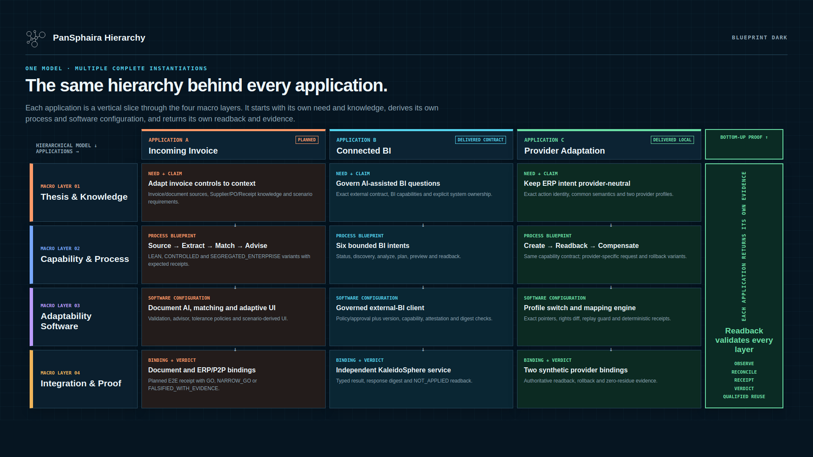

<p align="center">
  <picture>
    <source media="(prefers-color-scheme: dark)" srcset="assets/brand/pansphaira-icon-negative.svg">
    <source media="(prefers-color-scheme: light)" srcset="assets/brand/pansphaira-icon-positive.svg">
    
  </picture>
</p>

# PanSphaira

**Adapt any process. Prove what works.**

**Governed by default. Adaptable by design. Improved through evidence.**

PanSphaira is building a governed path from individual needs and source-bound
knowledge to AI-enabled process Blueprints, system-specific adaptations,
readback and reusable evidence. Today it proves bounded parts of that path
through released local-synthetic references; the general end-to-end product is
[work in progress](https://github.com/JoFe2/PANSPHAIRA/issues/360).

Build privately for your own environment, or contribute a proven adaptation to
an open Capability Library.

**Status:** [latest public evidence release](https://github.com/JoFe2/PANSPHAIRA/releases/latest)
· proof of concept · Linux x86_64 · [Apache-2.0](LICENSE)

[**See how it adapts**](#adaptive-knowledge-engineering) ·
[**Explore applications**](#applications) ·
[**Run the local PoC**](#quickstart) ·
[**Documentation**](https://jofe2.github.io/PANSPHAIRA/) ·
[**Contribute an adaptation**](CONTRIBUTING.md)

## Adaptive Knowledge Engineering

**Adaptive Knowledge Engineering** starts with the required outcome, the knowledge
available in the target environment, and the controls the process needs. Unlike
fixed automation or a generic AI promise, it keeps the adaptation traceable.

The product direction is to turn these inputs into a Capability or Process
Blueprint, materialize it through governed software components, bind it to
specific systems, and read the result back. Released local-synthetic slices
already prove individual layers and selected complete paths; arbitrary-process
generation and live-system adaptation remain planned.

<p align="center">
  
</p>

<p align="center"><em>Shared hierarchy, application-specific columns: each adaptation moves from thesis and knowledge through process and software to integration, readback, and qualified reuse.</em></p>

<details>
<summary>Accessible hierarchy description</summary>

The rows are Thesis and Knowledge, Capability and Process, Adaptability
Software, and Integration and Proof. The columns instantiate those layers for
planned incoming-invoice processing, the delivered optional KaleidoSphere BI
contract, and delivered local-synthetic ERP provider adaptation. A right-hand
axis returns observed state through reconciliation, receipt, verdict, and
qualified reuse.

</details>

**Need → Blueprint → governed process → integration → readback → reusable
evidence.** The [Canon](docs/CANON.md) and
[Architecture](docs/ARCHITECTURE.md) define the durable laws and technical
boundaries behind the hierarchy.

**Adapt once. Validate it. Reuse it everywhere it fits.**
Solve → Validate → Package as Knowledge → Share → Reuse → Improve.
Every integration can teach the system how to adapt the next one—without
silently expanding authority.

## Applications

### Adapt incoming-invoice processing to the controls the situation needs

`WORK IN PROGRESS · PLANNED · SHORT-TERM PROOF`

One AP model is designed to derive `LEAN`, `CONTROLLED`, and
`SEGREGATED_ENTERPRISE` process variants from evidence, risk, approval, and
separation needs—not from company-size stereotypes.

Track the [AP proof epic #360](https://github.com/JoFe2/PANSPHAIRA/issues/360)
and its delivery chain:
[AP-01 #361](https://github.com/JoFe2/PANSPHAIRA/issues/361) →
[AP-02 #362](https://github.com/JoFe2/PANSPHAIRA/issues/362) →
[AP-03 #363](https://github.com/JoFe2/PANSPHAIRA/issues/363) →
[AP-04 #364](https://github.com/JoFe2/PANSPHAIRA/issues/364) →
[AP-05 #365](https://github.com/JoFe2/PANSPHAIRA/issues/365) →
[AP-06 #366](https://github.com/JoFe2/PANSPHAIRA/issues/366).
Remove this work-in-progress marker only after #366 has a public local-synthetic PoC release and anonymous readback.

**[Explore the planned Source→Document AI→Matching→Advisor→UI→Receipt
PoC](docs/INCOMING-INVOICE-PROVING-GROUND.md).**

### Let AI agents ask better BI questions with KaleidoSphere

`DELIVERED CONTRACT · OPTIONAL · DEFAULT-OFF`

PanSphaira governs closed status, discovery, analyze, plan, preview, and
readback intents. Independently released
[KaleidoSphere](https://github.com/JoFe2/KaleidoSphere) owns BI discovery,
adapters, semantic/KPI/graph analysis, previews, and execution.

**[Explore connected AI-agent BI](docs/EXTERNAL-BI-SERVICE.md).**

### Keep the business capability stable while provider details change

`DELIVERED · LOCAL SYNTHETIC`

The `erp.order.create v1` PoC keeps its target-neutral consumer contract while
adapting request mappings, effective rights, and compensating rollback for two
synthetic provider bindings.

**[Inspect the provider-adaptation PoC](docs/CAPABILITY-CELL-ERP-ORDER.md).**

## Build privately. Extend it together.

Use the method with your own processes, systems, databases, and APIs. Your
Blueprints, adapters, tests, and receipts may remain entirely private.

Or contribute selected knowledge, a Blueprint, an implementation, or an
evidence package. Community review can confirm, narrow, improve, or falsify the
contribution before it becomes a versioned reusable option.

**Every contribution expands the option space. Evidence determines where it
fits.** See [Governed Knowledge Harvest](docs/KNOWLEDGE-HARVEST.md), the
[Capability Matrix](docs/capabilities.md), and [Contributing](CONTRIBUTING.md).

**Share what you know. Expand what everyone can build.** The Capability Library
is an open-ended, user-need-driven option space; each reusable option retains
its own evidence and applicability.

## Proof today

Current Main contains bounded local-synthetic evidence, not a universal product
claim:

- the `SAFE_GUIDED` CRM/ERP path binds policy and approval before effect, then
  verifies success through provider readback and a receipt;
- Competence–Knowledge Separation preserves external knowledge, qualification,
  and model-routing evidence without turning Knowledge into Authority;
- edge evidence and provider-adaptation proofs keep shared meaning separate from
  system-specific bindings;
- the optional external-BI contract keeps PanSphaira governance separate from
  KaleidoSphere BI ownership.

Each example links to its exact contract, tests, evidence class, and limits.
Start with the [secure-default proof](docs/SECURE-DEFAULT-PROOF.md), then inspect
[Security Assurance](docs/SECURITY-ASSURANCE.md) and [Known
Limitations](docs/KNOWN-LIMITATIONS.md).

## Quickstart

On Linux x86_64 with Docker Compose v2, `jq`, `curl`, OpenSSL, and `sha256sum`:

```sh
git clone https://github.com/JoFe2/PANSPHAIRA.git
cd PANSPHAIRA
git switch main
./demo/install.sh
```

Expected success is `READY_VERIFIED` plus loopback URLs. Remove only resources
owned by the installer:

```sh
./demo/uninstall.sh --purge
```

The [full Quickstart](docs/QUICKSTART.md) owns source verification, release
identity, prerequisites, optional subsystems, and cleanup details.

## Evidence and scope

- [Capabilities and maturity](docs/capabilities.md)
- [Canon](docs/CANON.md) and [Architecture](docs/ARCHITECTURE.md)
- [Security Assurance](docs/SECURITY-ASSURANCE.md)
- [Known Limitations](docs/KNOWN-LIMITATIONS.md)
- [Repository documentation](docs/README.md)

The root README introduces effects and routes every material claim to its
inspectable evidence. Detailed proof pages own exhaustive versions, tests,
falsifiers, receipts, and nonclaims.

The public repository provides an open-source proof-of-concept control plane
with a runnable local synthetic demo. PanSphaira's product direction is: An open, knowledge-driven operating system for governed,
adaptable AI ecosystems.
This broader direction is not a claim of current product maturity or universal live compatibility.
An unverified knowledge record may exist without becoming an authoritative default.

## Releases

- [Latest public evidence release](https://github.com/JoFe2/PANSPHAIRA/releases/latest)
- [All releases and history](https://github.com/JoFe2/PANSPHAIRA/releases)
- [Releases Atom feed](https://github.com/JoFe2/PANSPHAIRA/releases.atom)

Release pages own included capabilities, evidence boundaries, related
issues/PRs, tests, assets, and SHA-256 information. [Release
governance](docs/RELEASE-GOVERNANCE.md) defines publication and anonymous
readback.

## Project and community

[Contribute](CONTRIBUTING.md), [get support](SUPPORT.md), join
[Discussions](https://github.com/JoFe2/PANSPHAIRA/discussions), or report a
vulnerability through the [private security route](SECURITY.md). These public
routes do not create a support SLA.

Code is Apache-2.0 under [LICENSE](LICENSE), [NOTICE](NOTICE), and
[THIRD_PARTY_NOTICES.md](THIRD_PARTY_NOTICES.md). See [CITATION.cff](CITATION.cff)
for citation metadata.

Voluntary creator support:

<p>
  <a href="https://ko-fi.com/chimpmaera"></a>
  &nbsp;
  <a href="https://buymeacoffee.com/jimpansky"></a>
</p>
